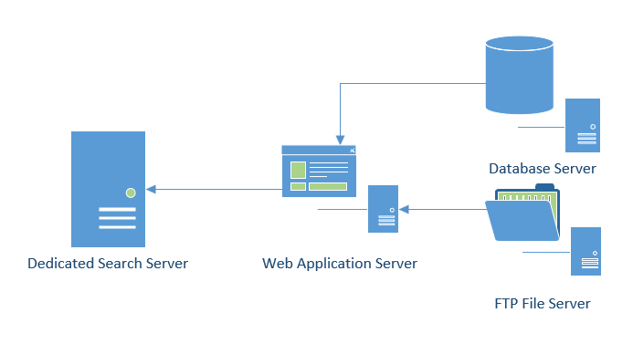

Apache Solr Search
==================

Overview and Summary
--------------------
Lorem ipsum dolor sit amet, consectetur adipiscing elit. Ut dictum diam fermentum accumsan commodo. Suspendisse ut imperdiet leo. Vivamus quis cursus elit. Vestibulum vestibulum sapien at enim tincidunt tempor. Suspendisse potenti. Vivamus nec ornare diam. Lorem ipsum dolor sit amet, consectetur adipiscing elit. Maecenas nec facilisis turpis. Pellentesque nunc nisi, tincidunt eget cursus quis, auctor imperdiet erat. Morbi quis mauris ligula. Suspendisse metus nunc, vulputate in rutrum non, vehicula vitae dolor. Class aptent taciti sociosqu ad litora torquent per conubia nostra, per inceptos himenaeos. Nulla arcu augue, placerat nec sem nec, aliquet placerat erat. Integer rutrum lectus eget massa fermentum, et lacinia sem tincidunt. Etiam id erat diam. Fusce metus dui, tristique eu justo eu, finibus aliquam nisl.

Mauris id vehicula leo, non aliquam eros. Suspendisse imperdiet lorem quis mauris pulvinar, vitae fringilla massa ultrices. Donec a leo non felis hendrerit tristique vel sit amet mauris. Fusce non pharetra libero. Nulla in augue quis ipsum blandit gravida. Nunc at ex dictum, venenatis odio eu, suscipit enim. Donec facilisis ante vitae leo viverra, quis tempus sapien fringilla. Morbi fermentum feugiat dolor. Phasellus mattis id tortor eget aliquet. Interdum et malesuada fames ac ante ipsum primis in faucibus. Etiam a lacus ante. Nunc non iaculis odio, ut consectetur erat. Integer ac tempor ipsum, at dapibus quam. Sed diam nibh, eleifend vitae malesuada in, lobortis at mauris. Duis eu lorem erat. Proin est leo, porta sed augue rhoncus, luctus finibus odio.

Maecenas vehicula dapibus odio, in faucibus dolor fringilla nec. Mauris vestibulum urna erat, a sodales est viverra at. Sed libero nulla, sodales nec maximus vel, pretium quis tortor. Fusce tellus eros, vehicula ut imperdiet mollis, finibus iaculis enim. Donec id mi mauris. Suspendisse molestie elementum feugiat. Nullam et interdum odio, vestibulum placerat arcu. Fusce laoreet, lacus ut ullamcorper mollis, leo odio gravida ex, pulvinar vestibulum felis tellus ac arcu. Integer nec enim cursus, tristique risus quis, volutpat velit. Aenean pretium elit eros, non hendrerit mauris euismod ac. Ut vitae posuere tellus, nec lobortis ligula. Duis arcu mi, suscipit non dui vel, ullamcorper imperdiet lectus.

Dependencies and Requirements
-----------------------------
Lorem ipsum dolor sit amet, consectetur adipiscing elit. Ut dictum diam fermentum accumsan commodo. Suspendisse ut imperdiet leo. Vivamus quis cursus elit. Vestibulum vestibulum sapien at enim tincidunt tempor. Suspendisse potenti. Vivamus nec ornare diam. Lorem ipsum dolor sit amet, consectetur adipiscing elit. Maecenas nec facilisis turpis. Pellentesque nunc nisi, tincidunt eget cursus quis, auctor imperdiet erat. Morbi quis mauris ligula. Suspendisse metus nunc, vulputate in rutrum non, vehicula vitae dolor. Class aptent taciti sociosqu ad litora torquent per conubia nostra, per inceptos himenaeos. Nulla arcu augue, placerat nec sem nec, aliquet placerat erat. Integer rutrum lectus eget massa fermentum, et lacinia sem tincidunt. Etiam id erat diam. Fusce metus dui, tristique eu justo eu, finibus aliquam nisl.

Since there is a Dockerfile included within this repository, all the dependencies will be automatically included into the project.
The dockerfile includes the following dependencies (the versions may change over time). 
This instance of Solr within a Docker and orchestrated by local instance of Kubernetes was developed on Ubuntu Server 16 LTS. This docker repository can be found at https://hub.docker.com/r/pandurx/solr-service/.

+---------------------------------+---------------------------------------------------------------------+
| Virtual Machine Specifications  |        Dependencies                                                 |
+=================================+=====================================================================+
|                                 |                                                                     |
+---------------------------------+---------------------------------------------------------------------+
| * Ubuntu Server 16 LTS          |        +---------------+---------+--------------------------------+ |
| * 4GB RAM                       |        | Library       | Version | Link                           | |
| * 100GB ROM                     |        +===============+=========+================================+ |
| * VMware Workstation 14 Player  |        | Apache Solr   | 7.3.0   | http://lucene.apache.org/solr/ | |
|                                 |        +---------------+---------+--------------------------------+ |
|                                 |        | Apache Groovy | 3.0.0   | http://groovy-lang.org         | |
|                                 |        +---------------+---------+--------------------------------+ |
|                                 |        | Apache Tika   | 1.17    | https://tika.apache.org/       | |
|                                 |        +---------------+---------+--------------------------------+ |
|                                 |        | Apache Maven  | 3.5.2   | https://maven.apache.org/      | |
|                                 |        +---------------+---------+--------------------------------+ |
|                                 |        | Open JDK      | 1.8.0   | http://openjdk.java.net/       | |
|                                 |        +---------------+---------+--------------------------------+ |
|                                 |        | Docker CE     |         | https://www.docker.com/        | |
|                                 |        +---------------+---------+--------------------------------+ |
|                                 |        | Kubernetes    |         | https://kubernetes.io/         | |
|                                 |        +---------------+---------+--------------------------------+ |
|                                 |        |               |         |                                | |
|                                 |        +---------------+---------+--------------------------------+ |
|                                 |                                                                     |
+---------------------------------+---------------------------------------------------------------------+
| Updated on June 1 2018                                                                                |
+-------------------------------------------------------------------------------------------------------+

Installation and Implementation
-------------------------------
Maecenas vehicula dapibus odio, in faucibus dolor fringilla nec. Mauris vestibulum urna erat, a sodales est viverra at. Sed libero nulla, sodales nec maximus vel, pretium quis tortor. Fusce tellus eros, vehicula ut imperdiet mollis, finibus iaculis enim. Donec id mi mauris. Suspendisse molestie elementum feugiat. Nullam et interdum odio, vestibulum placerat arcu. Fusce laoreet, lacus ut ullamcorper mollis, leo odio gravida ex, pulvinar vestibulum felis tellus ac arcu. Integer nec enim cursus, tristique risus quis, volutpat velit. Aenean pretium elit eros, non hendrerit mauris euismod ac. Ut vitae posuere tellus, nec lobortis ligula. Duis arcu mi, suscipit non dui vel, ullamcorper imperdiet lectus.

Installing Docker
^^^^^^^^^^^^^^^^^
Nam ut risus id ipsum blandit semper in sit amet ipsum. Ut tincidunt, justo at sagittis venenatis, turpis enim blandit metus, sit amet tempus lacus ex in turpis. Phasellus vitae aliquet quam, ultrices laoreet sapien. Cras varius ipsum nec enim porttitor sagittis. Quisque varius lacus pellentesque accumsan vestibulum. Integer nisi risus, maximus ut blandit in, finibus non nunc. Ut id eros et erat laoreet ornare malesuada sed risus. Mauris efficitur porttitor tempus. Donec odio neque, bibendum ac tempus non, viverra ac quam. Mauris malesuada luctus ultricies. Donec non lacus sagittis, fermentum libero ut, venenatis sapien. Aliquam semper varius orci. Donec eu odio porttitor, bibendum metus ullamcorper, hendrerit dui. Aenean sed placerat neque, in posuere nisl.

Nullam sed sagittis lorem. Curabitur mattis ut quam sit amet ultricies. Praesent eget tristique ex. Sed dignissim mauris nec nisi feugiat, eu euismod odio semper. Maecenas quis posuere ante. Sed quis egestas lorem. Aliquam non arcu sit amet leo dapibus interdum. Vestibulum id blandit eros, id porttitor erat. Pellentesque vitae ipsum et risus ornare vulputate aliquet vulputate nisi. Quisque sed faucibus magna, a aliquam mauris. Nulla sapien ligula, dapibus sed venenatis laoreet, rhoncus vitae quam. Suspendisse nec quam ultrices, rhoncus lacus nec, cursus lorem. Mauris maximus quam ante, hendrerit porta nulla porta quis. Fusce porta diam ut diam imperdiet imperdiet.

Installing Kubernetes (local virtual machine, optional)
^^^^^^^^^^^^^^^^^^^^^^^^^^^^^^^^^^^^^^^^^^^^^^^^^^^^^^^
Nam ut risus id ipsum blandit semper in sit amet ipsum. Ut tincidunt, justo at sagittis venenatis, turpis enim blandit metus, sit amet tempus lacus ex in turpis. Phasellus vitae aliquet quam, ultrices laoreet sapien. Cras varius ipsum nec enim porttitor sagittis. Quisque varius lacus pellentesque accumsan vestibulum. Integer nisi risus, maximus ut blandit in, finibus non nunc. Ut id eros et erat laoreet ornare malesuada sed risus. Mauris efficitur porttitor tempus. Donec odio neque, bibendum ac tempus non, viverra ac quam. Mauris malesuada luctus ultricies. Donec non lacus sagittis, fermentum libero ut, venenatis sapien. Aliquam semper varius orci. Donec eu odio porttitor, bibendum metus ullamcorper, hendrerit dui. Aenean sed placerat neque, in posuere nisl.

Nullam sed sagittis lorem. Curabitur mattis ut quam sit amet ultricies. Praesent eget tristique ex. Sed dignissim mauris nec nisi feugiat, eu euismod odio semper. Maecenas quis posuere ante. Sed quis egestas lorem. Aliquam non arcu sit amet leo dapibus interdum. Vestibulum id blandit eros, id porttitor erat. Pellentesque vitae ipsum et risus ornare vulputate aliquet vulputate nisi. Quisque sed faucibus magna, a aliquam mauris. Nulla sapien ligula, dapibus sed venenatis laoreet, rhoncus vitae quam. Suspendisse nec quam ultrices, rhoncus lacus nec, cursus lorem. Mauris maximus quam ante, hendrerit porta nulla porta quis. Fusce porta diam ut diam imperdiet imperdiet.

Commands Explained
------------------
Maecenas vehicula dapibus odio, in faucibus dolor fringilla nec. Mauris vestibulum urna erat, a sodales est viverra at. Sed libero nulla, sodales nec maximus vel, pretium quis tortor. Fusce tellus eros, vehicula ut imperdiet mollis, finibus iaculis enim. Donec id mi mauris. Suspendisse molestie elementum feugiat. Nullam et interdum odio, vestibulum placerat arcu. Fusce laoreet, lacus ut ullamcorper mollis, leo odio gravida ex, pulvinar vestibulum felis tellus ac arcu. Integer nec enim cursus, tristique risus quis, volutpat velit. Aenean pretium elit eros, non hendrerit mauris euismod ac. Ut vitae posuere tellus, nec lobortis ligula. Duis arcu mi, suscipit non dui vel, ullamcorper imperdiet lectus.

If you are currently logged in as root user on the linux machine, you might run into an error stating that you cannot start the solr service as that user. Typically, it is much safer to run the solr server with a different user account that has only access necessary directories and the access rights to run specific services that is required for the search functionality.

If the search engine is currently in development or testing, the service can be started with a root user with an additional parameter passed in. Otherwise, omit the ``-f`` flag if the service will be started with a non-root user.

**Please take note that the script to run the engine is in the ``/opt/solr/bin`` directory. The example below assumes that the the solr script is in the current directory**

running solr as a root user

``root@ubuntu:~# ./solr start -f``

``root@ubuntu:~# ./solr stop``

``root@ubuntu:~# ./solr restart -f``

running solr as a non-root user

``solr@ubuntu:~# ./solr start``

 
**Inline Markup**
-----------------
Words can have *emphasis in italics* or be **bold** and you can define
code samples with back quotes, like when you talk about a command: ``sudo`` 
gives you super user powers!